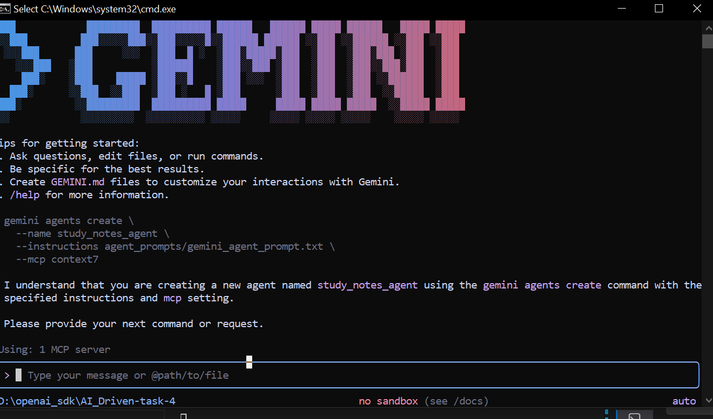

# Study Notes Summarizer & Quiz Generator

This project is a **Study Notes Summarizer and Quiz Generator** built using **Python**, **Streamlit**, **PyPDF2**, and **Context7 MCP + Gemini CLI**.  
It allows users to upload PDFs, automatically generate summarized study notes, and create quizzes based on the original content.

---

## **Features**

- Upload PDF files and extract text automatically.
- Generate meaningful summaries from PDF content.
- Generate quizzes (MCQs or mixed) based on the original PDF.
- Simple and clean **Streamlit UI**.
- MCP server integration for agent-based processing using Gemini CLI.

---

